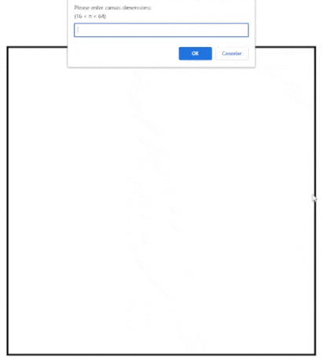

<h1>✏️ Etch-a-Sketch </h1>

 
 
 

 

Browser version of a sketchpad tool.

 

### :computer: Technologies Used

1. JavaScript
2. HTML
3. CSS

> Go to the exercise page on [The Odin Project's Website.](https://www.theodinproject.com/lessons/foundations-etch-a-sketch)

